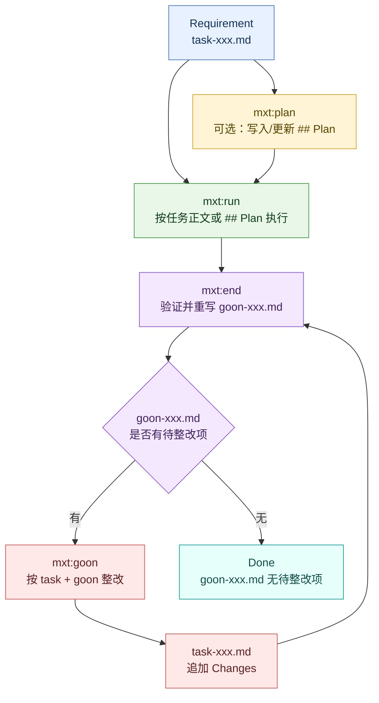

```mermaid
flowchart TD
    A["Requirement<br/>task-xxx.md"] --> B["mxt:plan<br/>可选：写入/更新 ## Plan"]
    A --> C["mxt:run<br/>按任务正文或 ## Plan 执行"]
    B --> C
    C --> D["mxt:end<br/>验证并重写 goon-xxx.md"]
    D --> E{"goon-xxx.md<br/>是否有待整改项"}
    E -- "有" --> F["mxt:goon<br/>按 task + goon 整改"]
    F --> G["task-xxx.md<br/>追加 Changes"]
    G --> D
    E -- "无" --> H["Done<br/>goon-xxx.md 无待整改项"]

    classDef requirement fill:#e8f1ff,stroke:#4a7bd1,color:#12325b,stroke-width:1px;
    classDef optional fill:#fff4d6,stroke:#d4a72c,color:#5b4300,stroke-width:1px;
    classDef execute fill:#e8f7e8,stroke:#43a047,color:#123d1b,stroke-width:1px;
    classDef verify fill:#f3e8ff,stroke:#8e5ad7,color:#41215f,stroke-width:1px;
    classDef remediate fill:#ffe8e8,stroke:#d45a5a,color:#5d1f1f,stroke-width:1px;
    classDef done fill:#e6fffb,stroke:#1aa39a,color:#0f4f4a,stroke-width:1px;

    class A requirement;
    class B optional;
    class C execute;
    class D,E verify;
    class F,G remediate;
    class H done;
```