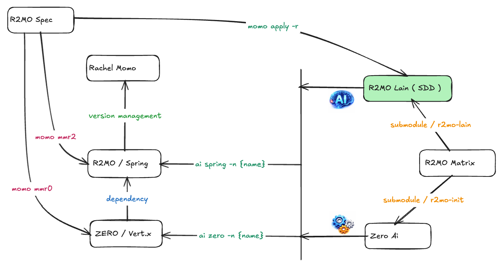
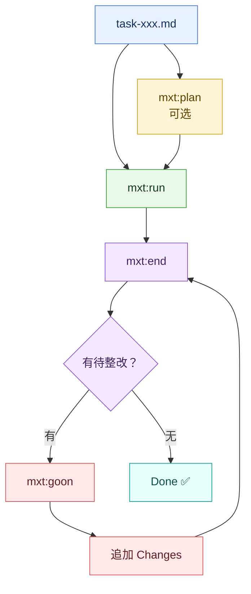

# SDD - Spec Driven Development 工具（命令名：`mxt`）

 | [](https://www.npmjs.com/package/r2mo-ai)
> For [Rachel Momo](https://www.weibo.com/maoxiaotong0216) / Serial Experiments Lain


## 引导

- 文档：<https://www.yuque.com/jiezizhu/r2mo>
  - [>> 快速开始](https://www.yuque.com/jiezizhu/r2mo/ssl9rl5klogu7cp0)
- 示例：<https://gitee.com/zero-ws/zero-rachel-mxt>



## 工具安装

**前置条件**：Node.js 18+（推荐 LTS 版本）

### macOS / Linux

```bash
npm install -g r2mo-ai
mxt help
```

若遇到全局安装权限问题，建议优先使用 nvm 管理 Node；临时处理可使用：

```bash
sudo npm install -g r2mo-ai
mxt help
```

### Windows

```bash
npm install -g r2mo-ai
mxt help
```

若遇到 PowerShell 执行策略限制：

```powershell
Set-ExecutionPolicy -Scope CurrentUser RemoteSigned
npm install -g r2mo-ai
mxt help
```

### 卸载

```bash
npm uninstall -g r2mo-ai
```

> Windows 提示：安装或卸载 `mxt ai-cmd` 前请关闭 Claude Code / Codex / OpenCode，避免文件锁定导致 `EPERM` 或 `EBUSY`。

---

## 核心功能

`r2mo-ai` 是 `SDD - Spec Driven Development` 命令行工具，命令名为 `mxt`。它面向 R2MO / MXT 工作流，提供项目初始化、规范文档、OpenAPI 提取、代码生成辅助、Obsidian 文档打开，以及 Claude Code / Codex / OpenCode 的 AI 命令安装与闭环执行提示词。

本教程按 `task-001` 的结构拆分：README 只保留入口教程、保留图和闭环图、保留索引；命令细节进入 `docs/command/`；`mxt ai-cmd` 的独立教程进入 `docs/ai-cmd.md`；`docs/skills/` 进一步拆成平台入口与每个 Skill 的独立说明。

---

### 入口索引

本页只保留核心索引，不再展开命令参数或执行细节。完整说明请看：

- [命令索引与各子命令详情](docs/command/README.md)
- [mxt ai-cmd 说明](docs/ai-cmd.md)
- [AI 平台与 Skills 索引](docs/skills/README.md)
- [Codex Skills 详情](docs/skills/mxt-plan.md)

### 闭环流程

`mxt ai-cmd` 安装的 AI 命令形成 `plan → run → end → goon` 闭环，`loop` 是自动闭环入口，`sync` / `start` / `debug` 为辅助命令。每个子命令和每个 Codex Skill 都有独立文档，便于逐页阅读与记录执行块。



闭环命令的具体写法、平台差异和技能说明已经拆到子文档里；这里仅保留流程图，便于首页快速理解整体循环。

### 发布

```bash
./publish.sh "release: update docs"
```

脚本会执行版本号更新、npm 发布、git 提交和推送。发布前请确认已登录 npm、拥有包权限，并且工作区只包含本次发布内容。

## 参考链接

- Maven 统一版本管理：<https://gitee.com/silentbalanceyh/rachel-mxt>
- Rapid 快速开发框架：<https://gitee.com/silentbalanceyh/r2mo-rapid>
- Zero Epoch：<https://www.zerows.io>
- Zero Demo：<https://gitee.com/zero-ws/zero-rachel-mxt>
- 旧版后端 Zero Ecotope：<https://www.zerows.io>
- 旧版前端 Zero UI：<https://www.vertxui.cn>
- 旧版工具 Zero AI：<https://www.vertxai.cn>
- 旧版标准 Zero Schema：<https://www.vertx-cloud.cn>
