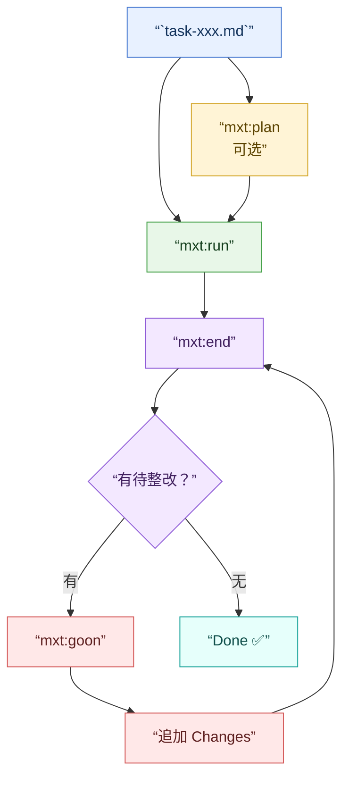

# SDD - Spec Driven Development 工具（命令名：`mxt`）

 | [](https://www.npmjs.com/package/r2mo-ai)
> For [Rachel Momo](https://www.weibo.com/maoxiaotong0216) / Serial Experiments Lain


## 引导

- 文档：<https://www.yuque.com/jiezizhu/r2mo>
    - [>> 快速开始](https://www.yuque.com/jiezizhu/r2mo/ssl9rl5klogu7cp0)
- 示例：<https://gitee.com/zero-ws/zero-rachel-mxt>


## 1. 介绍

### 1.1. 功能说明

`r2mo-ai` 是 `SDD - Spec Driven Development` 命令行工具，提供项目初始化、规范与 OpenAPI 辅助、任务提示词生成，以及 Claude Code / Codex / OpenCode 的 `mxt` AI 命令安装与刷新。

---

## 2. 工具使用

### 2.1. 安装

**前置条件**：Node.js 18+（推荐 LTS 版本）

**macOS / Linux**

```bash
npm install -g r2mo-ai
# 验证
mxt help
```

若遇到权限问题：

```bash
sudo npm install -g r2mo-ai
# 或使用 nvm 管理 Node 版本，避免 sudo
```

**Windows**

```bash
npm install -g r2mo-ai
# 验证
mxt help
```

若遇到执行策略限制（PowerShell）：

```powershell
Set-ExecutionPolicy -Scope CurrentUser RemoteSigned
npm install -g r2mo-ai
```

**卸载**

```bash
npm uninstall -g r2mo-ai
```

> **Windows 提示**：安装或卸载 `mxt ai-cmd` 时，请先关闭 Claude Code / Codex / OpenCode，否则文件可能被锁定导致操作失败。若仍遇到 `EPERM` 或 `EBUSY` 错误，关闭应用后重试即可。

### 2.2. 常用命令

#### 🛠️ 环境初始化（工程初始化）

| 命令 | 说明 | 选项 | 示例 |
|:---|:---|:---|:---|
| `mxt app` | 创建 R2MO/Spring 或 ZERO/Vertx 应用 | `-n` 指定名称 | `mxt app -n my-app` |
| `mxt apply` | 从远程仓库安装技能到当前项目 | `-i` 反馈到仓库 | `mxt apply` |
| `mxt env` | 环境信息检查 | | `mxt env` |
| `mxt focus` | 维护 DPA focus 配置与任务绑定 | `-d` 完成备份；`-c` 同步配置 | `mxt focus` |
| `mxt help` | 显示帮助的详细信息 | | `mxt help` |
| `mxt init` | 初始化 `.r2mo` 规范目录结构 | | `mxt init` |
| `mxt mcp` | 配置 MCP Skills Server | | `mxt mcp` |
| `mxt open` | 使用指定 AI 工具打开项目 | | `mxt open` |
| `mxt team` | 写入 `.r2mo/mxt.yaml` 角色配置 | | `mxt team` |
| `mxt ui` | 创建/更新 UI 子项目 | | `mxt ui` |

#### 📋 需求分析

| 命令 | 说明 | 示例 |
|:---|:---|:---|
| `mxt docs` | 使用 Obsidian 打开文档目录 | `mxt docs` |
| `mxt menu` | 扫描 `src/pages` 下 `menu.yaml` 打印树型菜单 | `mxt menu` |
| `mxt mod` | 拉取 r2mo-spec，拷贝 OpenAPI 到 `.r2mo/api/` | `mxt mod` |
| `mxt openapi` | 提取子项目 OpenAPI 文档到 `-ui/.r2mo/api/` | `mxt openapi` |

#### 🚀 开发实施

| 命令 | 说明 | 选项 | 示例 |
|:---|:---|:---|:---|
| `mxt admin` | 根据需求文档生成前端页面结构 | | `mxt admin` |
| `mxt dict` | 读取 schemas 导出字典 | `-r` 逆向生成 SQL | `mxt dict` |
| `mxt domain` | 执行 r2mo_proto 生成 Protobuf | | `mxt domain` |
| `mxt mmr0` | 下载并生成 Flyway SQL 文件 | | `mxt mmr0` |
| `mxt mmr2` | 下载并生成 Entity 类 | | `mxt mmr2` |

#### 🤖 SDD 开发

| 命令 | 说明 | 示例 |
|:---|:---|:---|
| `mxt ai-cmd` | 安装 AI 命令到 Claude Code / Codex / OpenCode | `mxt ai-cmd` |
| `mxt ask` | 从模板选择提示词复制到剪贴板 | `mxt ask` |
| `mxt plan` | 选择任务生成 Plan 提示词到剪贴板 | `mxt plan` |
| `mxt run` | 选择任务生成提示词到剪贴板 | `mxt run` |
| `mxt task` | 按 `task/thread` 配置对齐任务槽位 | `mxt task` |

### 2.3. AI 平台命令安装

`mxt ai-cmd` 将命令安装到 Claude Code、Codex、OpenCode 的可用位置。安装时菜单中会展示各平台的命令用法说明。命令源随 npm 包发布，位于 `agent/commands/`。

```bash
# 交互式选择安装平台（菜单中显示各平台用法）
mxt ai-cmd
```

每次安装会先清理该命令在所选平台上的旧记录，再写入最新命令并重新注册。重复执行可用于刷新索引。

---

#### 闭环流程

六个命令形成一个 `plan → run → end → goon` 闭环，`sync` 和 `start` 为辅助命令：



各步骤行为：

- **plan**（可选）— 只写回 `task-xxx.md` 的 `## Plan`，不执行实现
- **run** — 优先按已有 `## Plan` 执行，无 Plan 时按任务正文执行，追加 `Changes`
- **end** — 清空 `goon-xxx.md` 原始内容，写入当前待整改项
- **goon** — 按整改项执行，闭环记录追加回 `task-xxx.md` 的 `Changes`，再执行 `end` 验证

当 `end` 验证后 `goon-xxx.md` 无待整改项时，该编号任务闭环完成。

> `goon-xxx.md` 的 frontmatter `title` 必须与对应 `task-xxx.md` 标题一致，并追加 `整改-` 前缀。

---

#### 前置校验

`plan`、`run`、`end` 要求对应 `task-xxx.md` 在 frontmatter 之后必须存在非空正文。正文为空时命令立即返回，不执行后续提示词。`sync` 和 `start` 无前置校验，直接执行。

---

#### 各平台调用方式

**Claude Code / OpenCode** — slash command

| 命令 | 前置 | 写回 | 说明 |
|:---|:---|:---|:---|
| `/mxt:plan 001` | 正文非空 | `## Plan` | 不执行、不追加 Changes |
| `/mxt:run 001` | 正文非空 | `Changes` | 优先按 Plan 执行 |
| `/mxt:end 001` | 正文非空 | `goon-001.md` | 标题为 `整改-` + task 标题 |
| `/mxt:goon 001` | goon 存在 | `Changes` | 整改后再 end 验证 |
| `/mxt:debug` | 无 | 无 | BUG 排查 |
| `/mxt:sync` | 无 | 无 | Git 同步：提交、拉取、合并、推送 |
| `/mxt:start` | 无 | 无 | 拉起开发环境 |

**Codex** — plugin skill

| 命令 | 等价 | 说明 |
|:---|:---|:---|
| `$mxt-plan 001` | `/mxt:plan` | 写 Plan |
| `$mxt-run 001` | `/mxt:run` | 执行开发 |
| `$mxt-end 001` | `/mxt:end` | 验证整改 |
| `$mxt-goon 001` | `/mxt:goon` | 整改后验证 |
| `$mxt-debug` | `/mxt:debug` | BUG 排查 |
| `$mxt-sync` | `/mxt:sync` | Git 同步 |
| `$mxt-start` | `/mxt:start` | 拉起环境 |

参数 `001` 为三位数字任务编号，对应 `.r2mo/task/task-001.md`。格式不对时命令停止并提示正确用法。

不同命令的 `001` 含义：

| 命令 | `001` 对应文件 |
|:---|:---|
| `plan` / `run` / `end` | `.r2mo/task/task-001.md` |
| `goon` | `.r2mo/task/task-001.md` + `.r2mo/task/goon-001.md` |

文件不存在时命令直接询问最新任务号。

四个命令发送给 AI Agent 的提示词统一使用”任务派发单”短列表格式，包含输入范围、前置校验、调度策略和写回规则。

---

#### 卸载

```bash
mxt ai-cmd --uninstall
```

全量清理：已安装的平台会被删除，未安装的跳过。

---

#### 平台安装细节

**Claude Code**

- 写入 `~/.claude/commands/mxt:*.md`，按 Claude Code 官方 user commands 目录暴露 `/mxt:*`
- 写入 `~/.claude/plugins/marketplaces/mxt-skills`
- 写入 `~/.claude/plugins/cache/mxt-skills/mxt/1.0.0`
- 更新 `~/.claude/settings.json`（启用插件、注册 marketplace）
- 若 `claude` CLI 可用：自动执行 `plugin marketplace add/update` 和 `plugin install`
- 验证：`claude -p "/mxt:plan 001"` 不应返回 `Unknown command: /mxt:plan`；也可检查 `~/.claude/commands/mxt:plan.md`

**Codex**

- 写入 `~/.codex/plugins/mxt` 及 `~/.codex/marketplaces/mxt-skills`
- 写入 `~/.codex/prompts/mxt-*.md` 兼容 prompts
- 更新 `~/.codex/config.toml`（注册 marketplace 和 plugin）
- 若 `codex` CLI 可用：自动执行 `plugin marketplace add` 和 `plugin add`
- 验证：`codex plugin list`；`codex debug prompt-input` 中应出现 `mxt:mxt-plan` 等

**OpenCode**

- macOS / Linux：写入 `~/.config/opencode/opencode.json`
- Windows：写入 `%APPDATA%\opencode\opencode.json`
- 清理旧 `opencode.jsonc` 中该命令残留
- 验证：检查 `command[“mxt:plan”]` 等是否存在

安装后请重启应用或开启新会话，让命令或 skill 索引重新加载。

### 2.4. 发布

可直接通过 `./publish.sh "commit message"` 完成发布，脚本会依次执行：

1. `npm version patch --no-git-tag-version` — 自动升级补丁版本号
2. `npm publish --registry=https://registry.npmjs.org/` — 发布到 npm 官方源
3. `git add . && git commit -m "commit message" && git push` — 提交并推送代码

执行前需确认：

- 已执行 `npm login` 且拥有 `r2mo-ai` 包的发布权限
- 当前网络可访问 `registry.npmjs.org`
- git remote 和目标分支正确，工作区只包含本次要发布的文件

<hr/>

## 3. 参考链接

### 3.1. 旧版

- （后端）Zero Ecotope：<https://www.zerows.io>
- （前端）Zero UI：<https://www.vertxui.cn>
- （工具）Zero AI：<https://www.vertxai.cn>
- （标准）Zero Schema：<https://www.vertx-cloud.cn>

### 3.2. 新增

- Maven 统一版本管理：<https://gitee.com/silentbalanceyh/rachel-mxt>
- Rapid快速开发框架：<https://gitee.com/silentbalanceyh/r2mo-rapid>
- Zero Epoch：<https://www.zerows.io>
- Zero Demo：<https://gitee.com/zero-ws/zero-rachel-mxt>
