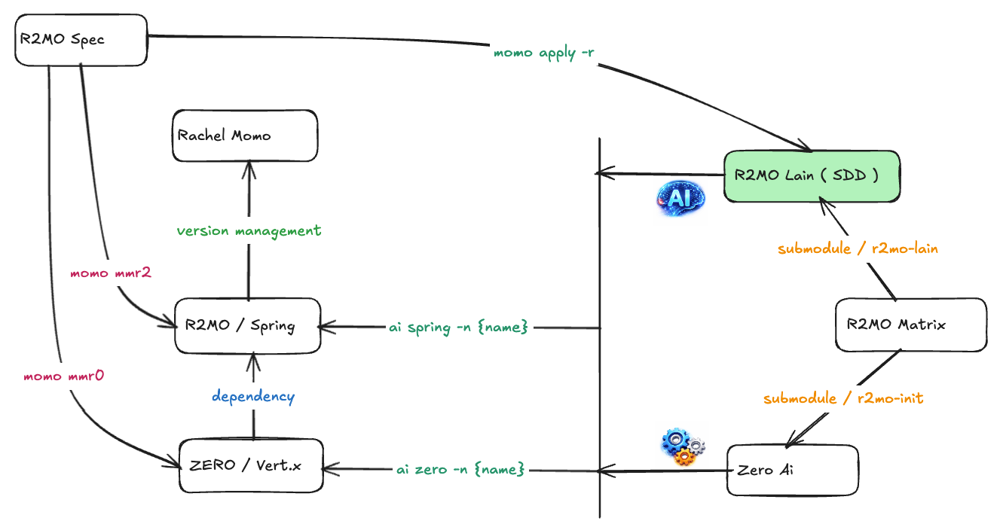
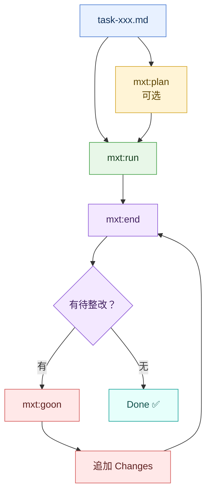

# SDD - Spec Driven Development 工具（命令名：`mxt`）

 | [](https://www.npmjs.com/package/r2mo-ai)
> For [Rachel Momo](https://www.weibo.com/maoxiaotong0216) / Serial Experiments Lain


## 引导

- 文档：<https://www.yuque.com/jiezizhu/r2mo>
  - [>> 快速开始](https://www.yuque.com/jiezizhu/r2mo/ssl9rl5klogu7cp0)
- 示例：<https://gitee.com/zero-ws/zero-rachel-mxt>



## 工具安装

**前置条件**：Node.js 18+（推荐 LTS 版本）

### macOS / Linux

```bash
npm install -g r2mo-ai
mxt help
```

若遇到全局安装权限问题，建议优先使用 nvm 管理 Node；临时处理可使用：

```bash
sudo npm install -g r2mo-ai
mxt help
```

### Windows

```bash
npm install -g r2mo-ai
mxt help
```

若遇到 PowerShell 执行策略限制：

```powershell
Set-ExecutionPolicy -Scope CurrentUser RemoteSigned
npm install -g r2mo-ai
mxt help
```

### 卸载

```bash
npm uninstall -g r2mo-ai
```

> Windows 提示：安装或卸载 `mxt ai-cmd` 前请关闭 Claude Code / Codex / OpenCode / Pi Agent，避免文件锁定导致 `EPERM` 或 `EBUSY`。

---

## 核心功能

`r2mo-ai` 是 `SDD - Spec Driven Development` 命令行工具，命令名为 `mxt`。它面向 R2MO / MXT 工作流，提供项目初始化、规范文档、OpenAPI 提取、代码生成辅助、Obsidian 文档打开，以及 Claude Code / Codex / OpenCode / Pi Agent 的 AI 命令安装与闭环执行提示词。

本教程按 `task-001` 的结构拆分：README 只保留入口教程、保留图和闭环图、保留索引；`docs/command/` 汇总 `mxt xxx` commands；`docs/skills/` 汇总 `mxt-*` Skills；具体命令和 Skill 细节只放到子文档。

---

### 入口索引

本页保留主入口和本轮新增能力的直达入口，不展开命令参数、平台差异或 Skill 细节：

- [mxt xxx Commands](docs/command/README.md) — `mxt` CLI 命令总览与每个子命令文档索引。
- [mxt-* Skills](docs/skills/README.md) — AI 闭环 Skills 总览、安装位置、配置信息与每个 Skill 文档索引。
- [mxt coder](docs/command/coder.md) — 本地代码知识库，负责全量扫描、增量更新和 AI 低成本阅读投影。
- [Codex /m* 短命令](docs/skills/codex-short-commands.md) — Codex-only 斜杠命令层，与同一套 MXT Skills 一一对应。

### 闭环流程

`mxt ai-cmd` 安装的 AI 命令形成 `plan → run → end → goon` 闭环，`loop` 是自动闭环入口，`task` 是扩展任务即时入口，`sync` / `start` / `debug` 为辅助命令。每个子命令和每个 Codex Skill 都有独立文档，便于逐页阅读与记录执行块。


```mermaid
flowchart TD
    A["task-xxx.md"] --> B["mxt:plan<br/>可选"]
    A --> C["mxt:run"]
    B --> C
    C --> D["mxt:end"]
    D --> E{"有待整改？"}
    E -- 有 --> F["mxt:goon"]
    F --> G["追加 Changes"]
    G --> D
    E -- 无 --> H["Done ✅"]

    classDef requirement fill:#e8f1ff,stroke:#4a7bd1,color:#12325b
    classDef optional fill:#fff4d6,stroke:#d4a72c,color:#5b4300
    classDef execute fill:#e8f7e8,stroke:#43a047,color:#123d1b
    classDef verify fill:#f3e8ff,stroke:#8e5ad7,color:#41215f
    classDef remediate fill:#ffe8e8,stroke:#d45a5a,color:#5d1f1f
    classDef done fill:#e6fffb,stroke:#1aa39a,color:#0f4f4a

    class A requirement
    class B optional
    class C execute
    class D,E verify
    class F,G remediate
    class H done
```

闭环命令的具体写法和 Skill 说明已经拆到子文档里；这里仅保留流程图，便于首页快速理解整体循环。

### 发布

发布拆成两个阶段，两个脚本都**不接受任何参数**：直接运行，全部动作自动完成；传任何参数都会报错退出。

```bash
./npm-login.sh    # 1) 鉴权：已登录只报告，未登录则起 npm 自己的登录流程
./npm-publish.sh  # 2) 自动定版本 → 发布到 npm 官方源 → 追加 git 全量提交并推送
```

- **浏览器那一步始终由你完成**：脚本不代开窗口、不代点确认。npm 需要什么（登录页 URL、一次性验证码、2FA 授权）就打印出来，然后等你操作；你完成之后脚本自己校验结果。
- **鉴权先于任何写入**：登录没成功，工作树和 registry 零副作用。
- 版本策略自动判断：当前版本还没发布过就按原样发布（首次发布），已经发布过就自动 patch +1。判定只认官方源的实时数据：本次运行使用独立的 npm 缓存目录，本地那份旧 packument 不会把「已发布」看成「没发布」（那会让每次重跑都撞 E409，永远发不出去）。`npm-publish.sh` 自己会先调用 `npm-login.sh`，所以单独跑第 2 步也安全。
- 发布成功后（仅当本次全部包都成功）以 `chore(release): r2mo-ai <版本>` 全量提交当前仓库（`git add -A`，版本升级一并进提交）并推送到上游。发布失败则不提交，改完再跑同一条命令即可。
- 两个脚本都会检测内网镜像：命中镜像就把 `registry.npmjs.org` 走公共 DNS 隧道打到官方源。登录前还会核对「registry 会把哪个登录页交给浏览器」：答案是 npmmirror 自己的会话页就直接中止，绝不把浏览器送过去；核对不出来时也只会如实说「无法核对」，不会谎报。
- `package.json` 里的 `publishConfig.registry` 只钉住了 URL 上的主机名：本机 DNS（或 `/etc/hosts`）把 `registry.npmjs.org` 指到内网镜像时，裸跑 `npm publish` / `npm login` **依然会落到镜像** —— 连浏览器登录页都会变成 `registry.npmmirror.com` 的会话页。要真打到官方源，就用上面这两个脚本。
- 无终端的环境（CI）自动读取 `$NPM_TOKEN`；有终端的交互运行永远走登录页，不会误用环境里的旧 token。

旧的一体式 `publish.sh` 已退役：版本 + 发布 + git 提交推送三件事，现在由上面两个阶段完成。

## 参考链接

- Maven 统一版本管理：<https://gitee.com/silentbalanceyh/rachel-mxt>
- Rapid 快速开发框架：<https://gitee.com/silentbalanceyh/r2mo-rapid>
- Zero Epoch：<https://www.zerows.io>
- Zero Demo：<https://gitee.com/zero-ws/zero-rachel-mxt>
- 旧版后端 Zero Ecotope：<https://www.zerows.io>
- 旧版前端 Zero UI：<https://www.vertxui.cn>
- 旧版工具 Zero AI：<https://www.vertxai.cn>
- 旧版标准 Zero Schema：<https://www.vertx-cloud.cn>
