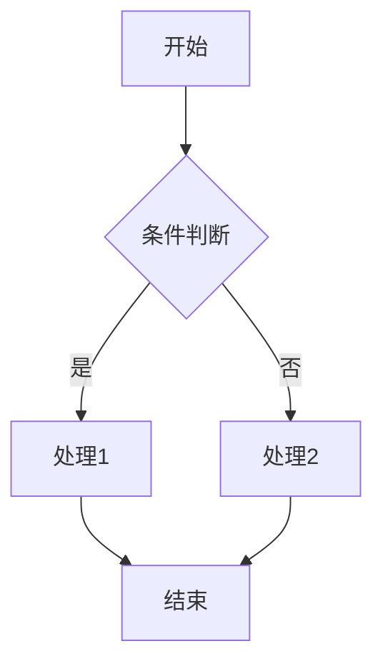

---
# ==============================================================================
# 🧩 Module Metadata / 模块元数据
# ==============================================================================
identifier: "requirement.module"  # 规范ID
id: "MOD_{CATEGORY}_{NAME}"       # 模块ID，如：MOD_SYS_ADMIN
name: "{模块中文名称}"             # 模块名称
code: "{module-code}"             # 模块代号/包名，如：sys-admin
version: "1.0.0"                  # 模块版本
owner: "{owner}"                  # 模块负责人
createdAt: "YYYY-MM-DD HH:mm"     # 创建时间
updatedAt: "YYYY-MM-DD HH:mm"     # 更新时间

# 🧬 UI Framework Configuration
route: "/{module-route}"          # 模块路由前缀，如：/sys-admin
store: "use{ModuleName}Store"     # 状态管理Store名称，如：useSysAdminStore
i18n: "{module-i18n}"             # 国际化命名空间，如：sysadmin
---

## 1. 模块概述

{简要描述模块的业务职责和价值，200-300字}

## 2. 核心功能

- **{功能1}**: {功能描述}
- **{功能2}**: {功能描述}
- **{功能3}**: {功能描述}

## 3. 业务流程

## 4. 数据模型

| 模型名称 | 说明 | 主要字段 |
|---------|------|---------|
| {Entity1} | {实体说明} | id, name, status, createdAt |
| {Entity2} | {实体说明} | id, title, type, updatedAt |

## 5. API清单

| 操作类别 | 说明 | 涉及实体 |
|---------|------|---------|
| 查询操作 | {查询相关的API说明，如：列表查询、详情查询、条件过滤} | {Entity1}, {Entity2} |
| 数据变更 | {变更相关的API说明，如：创建、更新、删除、批量操作} | {Entity1}, {Entity2} |
| 业务流程 | {业务流程相关的API说明，如：审批、状态变更、工作流} | {Entity1} |
| 辅助功能 | {辅助功能相关的API说明，如：导出、导入、统计分析} | {Entity1}, {Entity2} |

> **注**: 具体API端点定义在 `.r2mo/api/metadata.yaml` 中，按 `{module-prefix}` 匹配提取

## 6. 页面清单

| 页面名称 | 路由 | 类型 | 说明 |
|---------|------|------|------|
| {页面1} | /{module}/{page1} | list | {页面说明} |
| {页面2} | /{module}/{page2} | form | {页面说明} |
| {页面3} | /{module}/{page3} | detail | {页面说明} |

## 7. 系统集成

- **{System1}**: {集成说明和接口描述}
- **{System2}**: {集成说明和接口描述}

## 8. 权限要求

| 角色 | 权限范围 |
|------|---------|
| {Role1} | {可执行的操作范围} |
| {Role2} | {可执行的操作范围} |
